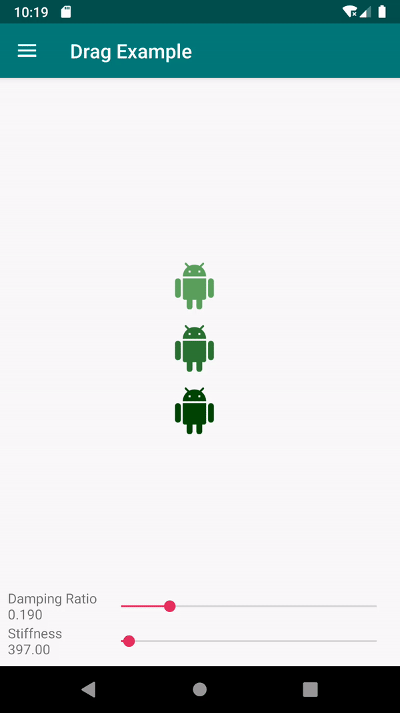
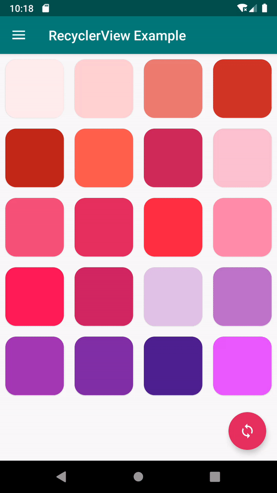

# SpringX

[](https://opensource.org/licenses/Apache-2.0)
[  ](https://bintray.com/lcdsmao/maven/springx/_latestVersion)


SpringX is an Android library that allows developers to easily use [SpringAnimation](https://developer.android.com/reference/android/support/animation/SpringAnimation).

## Demo

| [Demo1](./sample/src/main/java/com/github/lcdsmao/springsample/DragExampleFragment.kt) | [Demo2](./sample/src/main/java/com/github/lcdsmao/springsample/SpringMoveItemAnimator.kt) |
|-|-|
|  |  |


## Installation

```gradle
implementation 'com.github.lcdsmao:springx:0.0.1'
```

## Usage

You can manually create the `ViewPropertySpringAnimator` or use the extension function:
 
```kotlin
val spring = ViewPropertySpringAnimator(view) // Always create a new one
// or
val spring = view.spring() // Reuse the one that associated with this view
```

The syntax of `ViewPropertySpringAnimator` is simliar to `ViewPropertyAnimator`:

```kotlin
spring
  .rotation(30f)
  .scaleX(2f)
  .scaleY(2f)
  .y(500f)
  .x(500f)
  .start()
```

Complicated control are also allowed:

```kotlin
spring
  .defaultDampingRatio(0.7f) // default damping ratio for all animations
  .defaultStiffness(5f) // default stiffness for all animations
  .rotation(30f)
  .translationX(100f) {
      startVelocity = 30f // set start velocity of TRANSLATION_X
      dampingRatio = 0.3f // override the damping ratio
      onUpdate { spring, value, velocity ->
        // the update listener that associated with TRANSLATION_X
      }
  }
  .translationY(200f) {
      onUpdate { spring, value, velocity ->
        // the update listener that associated with TRANSLATION_Y
      }
      onEnd { spring, canceled, value, velocity ->
        // the end listener that associated with TRANSLATION_Y
      }
  }
  .setListener(
      onEnd = {
        // the end listener will be called when all animations end
      }
  )
```

## Thanks

This library is inspired by the talk: [Motional Intelligence: Build Smarter Animations (Google I/O'19)
](https://youtu.be/f3Lm8iOr4mE?t=709)

## Contributing

Pull requests are welcome. For major changes, please open an issue first to discuss what you would like to change.

## License

```
Copyright 2019 Mao Yufeng

Licensed under the Apache License, Version 2.0 (the "License");
you may not use this file except in compliance with the License.
You may obtain a copy of the License at

    http://www.apache.org/licenses/LICENSE-2.0

Unless required by applicable law or agreed to in writing, software
distributed under the License is distributed on an "AS IS" BASIS,
WITHOUT WARRANTIES OR CONDITIONS OF ANY KIND, either express or implied.
See the License for the specific language governing permissions and
limitations under the License.
```
